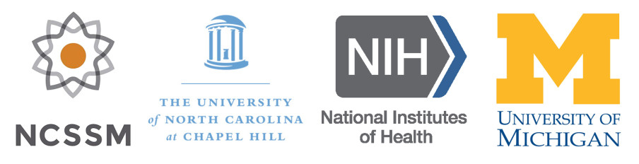

I am currently pursuing a **PhD in Bioinformatics** and **Master of Arts in Statistics** at the **University of Michigan** in Ann Arbor, MI as a **National Science Foundation Graduate Research Fellow** and **Genome Sciences Predoctoral Trainee**. I am excited about the future for human genomics and genetics in the new age of high-throughput sequencing, big data, and the $1,000 genome. My career goal is to work in a collaborative research environment combining quantitative genomics, computational biology, and clinical application to fulfill the promise of **Precision Medicine**. I spent two years as a postbaccalaureate intramural research trainee in the **National Human Genome Research Institute** of the National Institutes of Health in Bethesda, MD. I am a native of North Carolina and a graduate of the **University of North Carolina at Chapel Hill**. I graduated in May 2013 with a **Bachelors of Science in Quantitative Biology** as a member of the **Phi Beta Kappa National Honor Society**, having earned highest honors and highest distinction. My love for genetics extends to my childhood and became part of my career goals during Molecular and Classical Genetics high school courses at the **North Carolina School of Science and Math**. Outside of research I enjoy teaching science and computer programming to K-12 students, science writing, and running.

